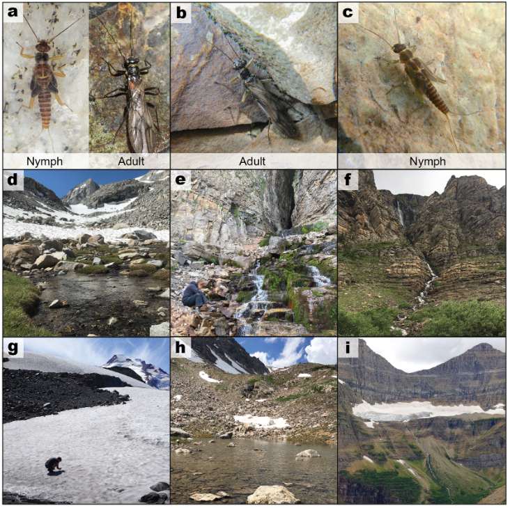
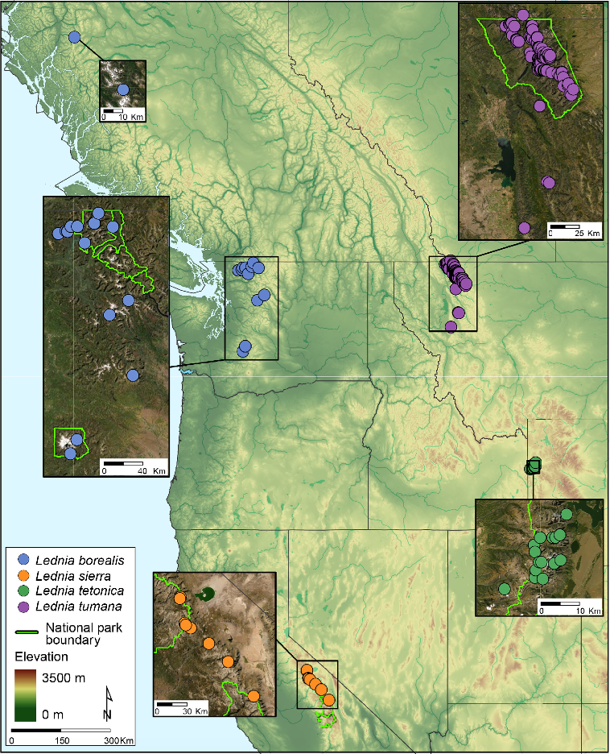
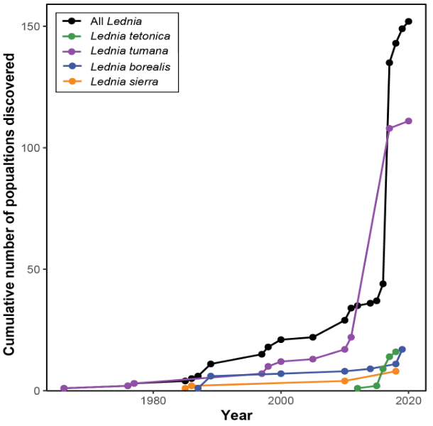
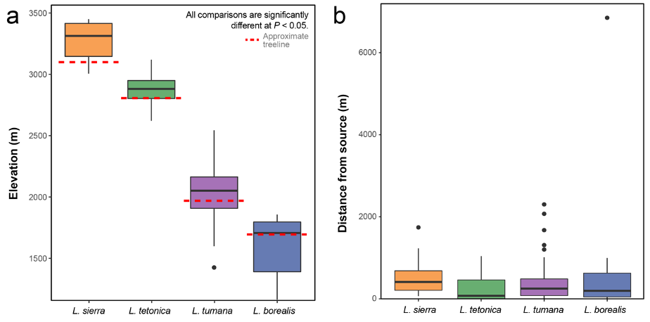
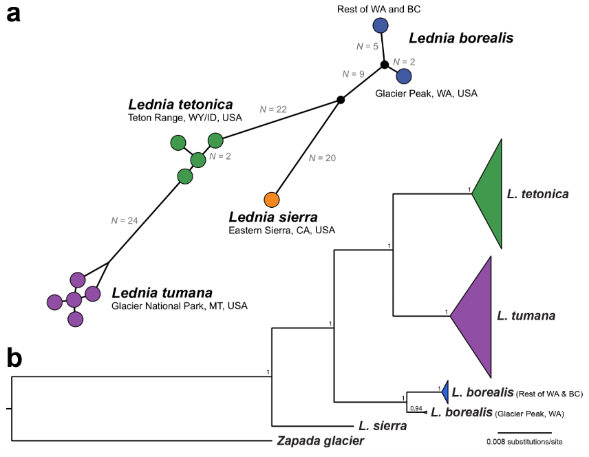
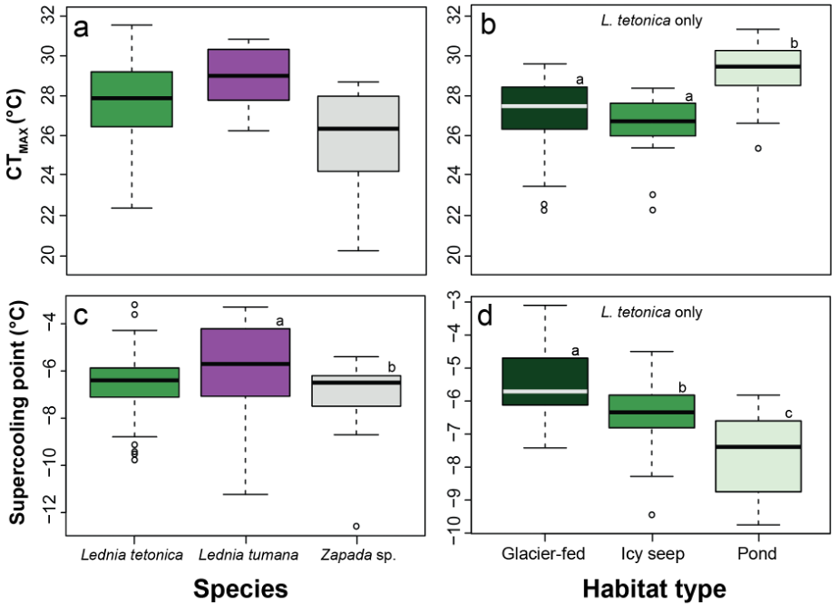

# Lednia

Title: Stoneflies in the genus Lednia (Plecoptera: Nemouridae): sentinels of climate change impacts on mountain stream biodiversity
Jounral: Biodiversity and Conservation, 2022

https://link.springer.com/article/10.1007/s10531-021-02344-y

Authors: Matthew D. Green, Lusha M. Tronstad, J. Joseph Giersch, Alisha A. Shah, Candace E. Fallon, Emilie Blevins, Taylor R. Kai, Clint C. Muhlfeld, Debra S. Finn & Scott Hotaling

# Results

### Fig 1: Examples of Lednia and the high-elevation habitats they reside in. a–c Nymphs and adults across species (a Lednia tetonica, b–c Lednia tumana). d A snowmelt-fed stream, Rock Creek, in the high Sierra Nevada, California, USA, hosts a population of Lednia sierra. e A stream fed by subterranean ice emanat-ing from Wind Cave in the Teton Range, Wyoming, USA, and the type locality for L. tetonica. f A snow-melt-fed stream in Glacier National Park, Montana, USA containing L. tumana.  g A researcher collecting Lednia borealis adults emerging from a meltwater seep on the margins of the Sholes Glacier, Washington, USA. h A meltwater pond unofficially referred to as “Tetonica Pond” where a population of L. tetonica resides in Grand Teton National Park, Wyoming, USA. i A meltwater stream emerging from the Sexton Glacier (center of the photo) in Glacier National Park, Montana, USA. Despite harsh conditions, L. tumana are dominant members of the non-Dipteran aquatic invertebrate community in this stream (Giersch et al. 2017). Photos by: a–c Joe Giersch, d Matthew Green, e, f, h, i Scott Hotaling, and g Emilie Blevins.

### Fig 2: All known extant populations of Lednia, color-coded by species. Green outlines in inset views of terrain represent national park boundaries. Locality information is included in TableS1 and stems from an array of published (Ricker 1952; Gaufin et al. 1972; Donald and Anderson 1977; Kondratieff and Lechleitner  2002; Baumann and Kondratieff 2010; Muhlfeld et al. 2011; Kubo et al. 2013; Giersch et al. 2017; Hotaling et al. 2018; Hotaling et al. 2018; Tronstad et al. 2020; Fallon et al. in press) and unpublished data.

### Fig 3: The cumulative number of populations discovered through time for all Lednia and each species, respectively. The year of discovery corresponds to the publication year for the study detailing the findings (if published).

### Fig 4: Variation in a elevation and b distance to  source across Lednia species. Complete methods and results for these figures are provided in Supporting Information and Tables S2–S3, respectively. Approxi-mate treeline in (a) was visually estimated using Google Earth imagery.

### Fig 5: A re-analysis of sequence data included in Hotaling etal. (2019b) with new samples of Lednia bore-alis added (see Supporting Information). a Cytochrome oxidase c subunit I (COI) haplotype network of all available Lednia sequences. Colored circles represent haplotypes and N indicates the number of substitution steps (i.e., one nucleotide difference) between haplotypes. b COI gene trees for all Lednia sequences. Ter-minal nodes for everything except L. borealis (the new sequences included in this study) were compressed into triangles and scaled according to the number of sequences. Numbers above nodes are posterior prob-abilities.

### Fig 6: Critical thermal maximum (CTMAX) for a) L. tetonica, L. tumana, and Zapada sp. And b) L. teton-ica only (grouped by stream type). Supercooling points of c) Lednia tetonica, Lednia tumana, and another alpine stonefly, Zapada sp. And d) L. tetonica only (grouped by stream type). Lower-case letters within plots indicate significant differences between groups at P < 0.05. Data re-plotted from Hotaling et al. (2020b) and Hotaling et al. (2021a, b).

